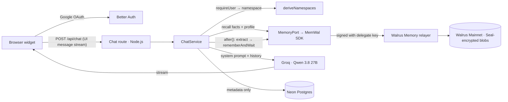

# Architecture



## Module boundaries

| Layer | Path | May depend on |
|---|---|---|
| UI | `src/components/**` | `/api/*` over HTTP, `src/lib` (client-safe), `src/config`, `src/types` — never `src/server` |
| Routes | `src/app/api/**/route.ts` | thin adapters: `src/server/container.ts` + handler factories |
| Handlers | `src/server/api/*.ts`, `src/server/chat/chat-service.ts` | interfaces injected as deps (repositories, `MemoryPort`, `ModelFactory`, `RateLimitPolicy`, user resolver, `after`) |
| Memory | `src/server/memory/**` | `MemoryPort` interface; MemWal adapter is the only file that imports the SDK client (`server-only`) |
| LLM | `src/server/llm/**` | AI SDK + Groq provider; prompts are pure functions |
| Data | `src/server/db/**` | Drizzle; repositories take any `PgDatabase` (Neon, node-postgres, PGlite) |
| Shared | `src/lib`, `src/types`, `src/config` | no server-only imports |

`src/server/container.ts` is the single place where concrete implementations are wired; tests build the same handlers with PGlite repositories, `FakeMemoryPort`, `MockLanguageModelV3` and a captured `after()`.

## A chat turn

1. `requireUser(request)` → 401 JSON if no session. Rate limit (20/min, 300/day) → 429 + `Retry-After`.
2. Zod-validate `{ sessionId, messages }` (≤40 messages, text parts ≤4000 chars, last message from the user) → 400 with issue paths.
3. Load the coaching session **scoped to the user** (another user's id → 404); ended → 409.
4. Namespaces from the user id (+ `namespace_version`); memory port = MemWal (with circuit breaker) or noop (Amnesia Mode).
5. `recallForTurn` — facts / profile (cached) / first-turn recap in parallel, deduped by blob id, never throws.
6. `buildSystemPrompt` — role, mode rubric, learning style, `<coach_memory>` untrusted block, memory policy (degraded/amnesia variants).
7. Stream: `data-memory` part first (chips), then `streamText` → UI message stream (reasoning hidden, errors become friendly text).
8. `after()` — increment turn count, record `recall_events` (blob ids + metrics), then (consent + memory on + a real reply) `persistTurn`.

## Persistence pipeline

```
extract (generateText + Output.object, strict JSON schema)
  → drop injection-like facts → clean/cap text → drop near-duplicates (≥0.9)
  → encode lines ([kind][at][session])
  → rememberBulkAsync (≤20/batch)
      onAccepted → INSERT memory_events (pending)   ← one transaction
  → waitForRememberJobs
      done → UPDATE status=done, blob_id            ← one transaction
      transient failure (e.g. upstream 429) → resubmit, re-point the same row
      timeout → stays pending → reconcilePendingJobs (summary polling / cron)
  → profile snapshot (merged) to the profile namespace, cache refreshed
```

## Data model (Postgres — metadata only)

- `user`, `session`, `account`, `verification` — Better Auth (login sessions; generated by the `auth` CLI).
- `user_settings` — onboarding + explicit memory consent timestamps, `namespace_version`.
- `coaching_sessions` — mode, Amnesia flag, generic title, turn count, timestamps.
- `memory_events` — one row per memory write: namespace, kind, job id, blob id, status, error code, latency. `CHECK (status <> 'done' OR blob_id IS NOT NULL)`.
- `recall_events` — recalled blob ids, result count, best distance, latency, degraded flag/reason.

No table has a column for memory text or messages.

## Failure behaviour

| Failure | Behaviour |
|---|---|
| Relayer unreachable / recall timeout | Reply streams with `degraded: true`, UI notice, `recall_events.degraded = true` |
| Circuit breaker open | Recall skipped instantly (degraded) |
| Delegate key invalid / account mismatch | Degraded; `memory.auth_error` logged once per instance; `/api/health` relayer down |
| SDK/relayer incompatibility | Degraded; surfaced in `/api/health` |
| Save job fails | Row `failed` with code; summary shows “N memories couldn't be saved” |
| Groq 429/5xx | One retry; friendly error text in the stream; client offers Retry |
| Groq model not found | `llm.model_not_found` logged with model id; message tells admins to update `GROQ_MODEL` |
| DB down | 503 JSON; widget shows a Reconnect state |
| Invalid input | 400 with Zod issue paths |
